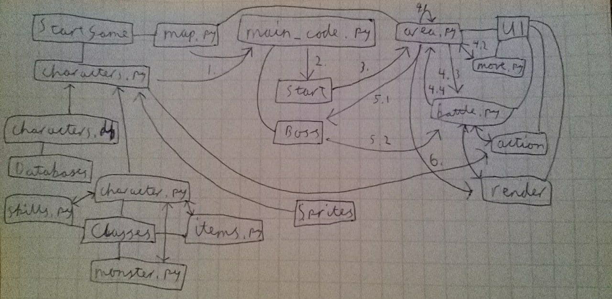

# Arkkitehtuuri

## Rakenne

Kuvassa näkyy src-hakemistossa olevat alihakemistot ja niiden sisällöt sekä tiedosto main_code.py, joka aloittaa pelin suorituksen. Henkilöiden tekemiseen ja toimintaan liittyvät luokat löytyvät Classes-hakemistosta. Lisäksi on erillinen Sprites-hakemisto, missä on tarvittavat kuvat henkilöille sekä taustoille. StartGame-hakemistossa on pelin aloitukseen tarvittavat tiedostot ja UI-hakemistosta löytyy käyttöliittymään liittyvät tiedostot. Nuolet näyttävät, mitkä hakemistot ja tiedostot ovat liitoksissa mihin.

## Käyttöliittymä
Pelillä on viisi eri näkymää, joihin törmää tässä järjestyksessä:
- Kartan valinta
- Hahmojen valinta
- Kartan alue
- Taistelu
- Pelin lopetus

Näistä näkymistä huolehtii tiedosto render.py, jossa on eri funktioita eri näkymille. Kartan ja hahmojen valinta näkymissä pelaaja valitsee numeronäppäimillä haluamansa kartan ja hahmot, jolloin näkymä vaihtuu. Näkymissä on tekstinä/kuvina valinnat ja niitten vieressä valintoja vastaavat numerot. Kartan alue näkymässä on seinillä varustettu alue, jossa pelaaja ja viholliset liikkuvat. Pelaaja liikkuu nuolinäppäimillä ja siirtyy näkymästä törmätessään viholliseen. Taistelu näkymässä on piirrettynä hahmojen ja vihollisten spritet ja tiedot sekä pelaajalle mahdolliset toiminnot. Taistelusta siirrytään seuraavaan näkymään, kun joko kaikki viholliset tai hahmot ovat kuolleet. Pelin lopetus näkymässä on joko onnittelu tai "Game Over" teksti riippuen voittiko vai hävisikö pelaaja pelin. Tästä näkymästä päästään sulkemalla peli.

## Sovelluslogiikka

Edellisestä kuvasta voimme myös nähdä sovelluslogiikan numeroitujen nuolien perusteella:
1.  main_code.py-tiedosto saa StartGame:n tiedostoilta itselleen kartan, pelattavat hahmot sekä viholliset.
2.  main_code.py-tiedosto aktivoi kartan sisältävän start- eli aloitusalueen, johon se sisältää hahmot ja viholliset.
3.  Start alue alkaa pyörittämään area.py:n koodia, jolloin pelaaminen voidaan aloittaa nuolinäppäimillä hahmoa liikuttamalla.
4.
- Kun alueesta siirrytään toiseen, niin area.py vie hahmot ja viholliset seuraavaan alueeseen ja alkaa pyörittämään sen koodia.
- area.py käyttää move.py-tiedostoa rekisteröimään pelaajan antamat liikkumiskomennot.
- Kun pelaata törmää viholliseen, niin koodi siirtyy battle.py-tiedostoon, jossa pelaaja hallinnoi taistelua vihollisia vastaan numeronäppäimillä action.py-tiedostoa käyttäen ja piirtämällä tarvittavat tiedot render.py tiedostolla.
- Kun taistelu on voitettu, niin siirrytään takaisin area.py:n koodiin siihen, missä viholliseen törmättiin, mutta vihollinen on poistettu alueesta. Vaihtoehtoisesti taistelu hävitään ja peli loppuu.
5.
- Pelaaja löytää main_code.py:n määrittämän boss-huoneen.
- Pelaaja kävelee boss-vihollisen luo ja aloittaa taistelun sen kanssa.
6.  Pelaaja voittaa boss-vihollisen ja area.py piirtää voittoruudun render.py:n avulla ja odottaa pelaajan lopettavan pelin sulkemalla pygamen ikkunan.

## Tietokannat
Peli käyttää apunaan yhtä tietokantaa, jossa on kaikkien hahmojen, vihollisten, taitojen ja itemien tiedot. Vaikkakin tämä tietokanta on valmiiksi luotuna, niin olen jättänyt pelaajalle database_creator.py tiedoston, jolla sen voi luoda uudestaan ja helposti muuttaa sen tietoja ja luoda uusia hahmoja/vihollisia/taitoja/itemeitä. Näin esimerkiksi pelin vaikeutta voidaan helposti säädellä.

## Peliin rakenteeseen jääneet heikkoudet
Sovelluslogiikkaa ja käyttöliittymää olisi voinut erottaa toisistaan vielä vähän enemmän.
