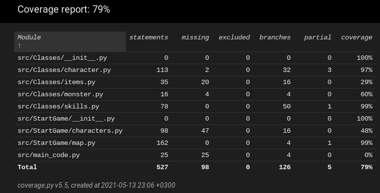

# Testausdokumentti

## Luokkatestit
Luokat "Character" ja "Skill" ovat perusteellisesti testattu. Tämä suurilta osin varmistaa, että sekä taisteleminen että alueilla liikkuminen toimivat kuten pitää. 

## Pelin aloittamis testit
Funktiot "generate_map", "generate_monsters" ja "give_items" ovat testattu, että ne varmasti palauttavat oikeat asiat ja peli voi alkaa ja toimia oikein.

## Testauskattavuus

Kattavuus on 79%, kun testejä, käyttöliittymää ja tietokannan luomista ei oteta huomioon. Tietokannan luomista ei ole tarvetta ottaa huomioon, koska ohjelma itse
ei sitä suorita, vaan sitä käytetään vain, kun pelaaja haluaa helposti muokkailla tai luoda uusia henkilöitä, taitoja tai itemejä. Itse tietokanta on jo valmiiksi
olemassa. Testauksesta puuttuu "Item" ja "Monster" luokkien testaus, mutta nämä luokat ovat pieniä ja yksinkertaisia eikä niitten toiminnassa pitäisi tulla ongelmia.
Characters-tiedoston testaus on myös puolittainen, sillä siinä ei ole täysin eriytetty käyttöliittymää pois, niin sitä ei voida myöskään täysin testata. Main_code
tiedostoa ei ole suoraan testattu, mutta StartGame-testit testaavat sen toimintaa.

## Asennus
Peli on kokeiltu ladata ja asentaa Linux-koneelle ohjeita noudattaen ja toiminut ongelmitta.
